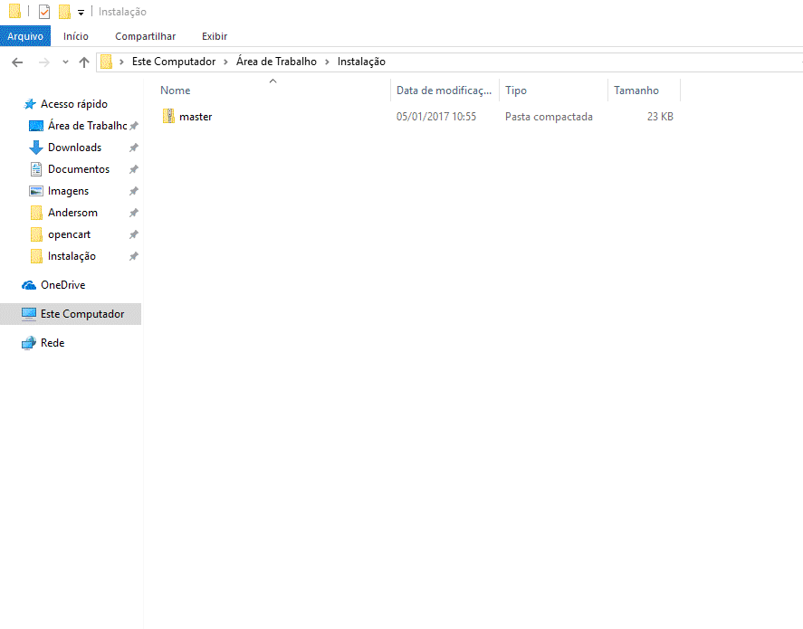
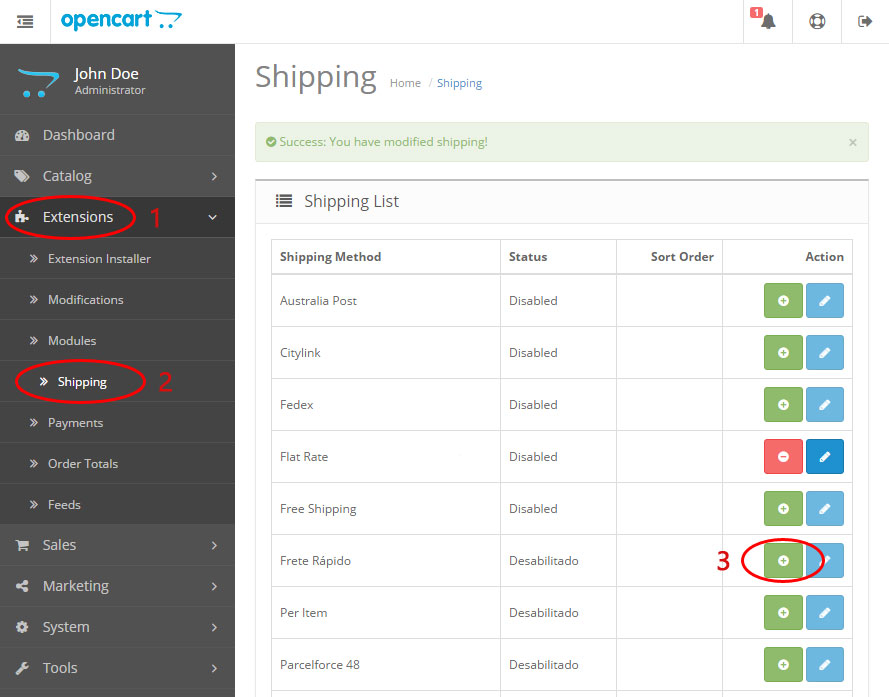
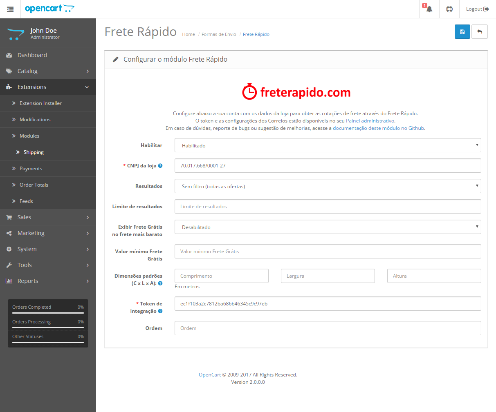
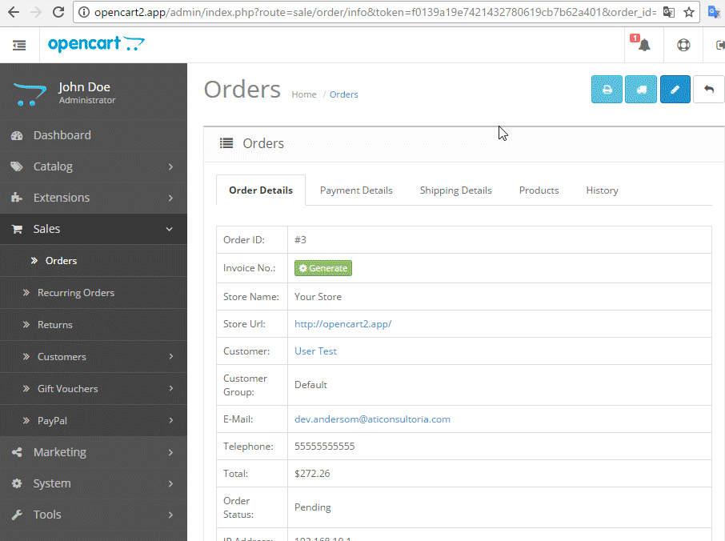

### **Módulo para plataforma OpenCart**

Versão do módulo: 1.0.2

Compatibilidade com OpenCart: **2.0.x** a **2.2.x**

Links úteis:

- [OpenCart Extension Store][1]
- [Painel administrativo][2]
- [suporte@freterapido.com][3]

-------------

### IMPORTANTE

Este módulo é apenas um referencial de integração e cabe ao cliente a função de configurá-lo e adaptá-lo a sua respectiva loja, levando em conta as particularidades e conflitos que podem surgir durante o processo de integração.

A Frete Rápido não mantem e/ou oferece suporte para a integração com o **OpenCart**, disponibilizamos o módulo padrão que atente a modalidade de envio simples.

**Este módulo não opera Dropshipphig!**

Caso seja necessário adaptações deste módulo para atender a sua loja, é possível alterar o código fonte, desde que atenda a [API da Frete Rápido][8]. E [neste link][7] você encontra a documentação de orientações do **OpenCart**.

A Frete Rápido não se responsabiliza por eventualidades advindas deste módulo.

----------

### Requisito "vQmod"

>**ATENÇÃO!** Recomendamos que seja feito backup da sua loja antes de realizar qualquer instalação. A instalação desse módulo é de inteira responsabilidade do lojista.

- Para a instalação do módulo **Frete Rápido** na sua loja é necessário ter previamente instalado o plugin **vQmod** que pode ser [baixado nesse link][9] (versão mínima 2.6.1);
- Descompacte/Extraia o arquivo "zip" que baixou;
- Copie o diretório "**vqmod**" criado em "**vqmod-x.x.x** > **upload**" para o diretório raiz da sua loja;
- Agora, acesse o caminho de na sua loja conforme exemplo: http://dominiodasualoja.com.br/vqmod/install;
- Ao concluir a instalação com sucesso, deverá ser apresentada a seguinte mensagem: _VQMOD HAS BEEN INSTALLED ON YOUR SYSTEM!_

--------------

### Instalação

>**ATENÇÃO!** Recomendamos que seja feito backup da sua loja antes de realizar qualquer instalação. A instalação desse módulo é de inteira responsabilidade do lojista.

- [Baixe aqui a última versão][4];
- Descompacte/Extraia o arquivo "zip" que baixou;
- Copie todo o conteúdo extraído para o diretório raiz da sua loja;
- Agora, acesse a área administrativa de sua loja para concluir a instalação;

---

### Habilitando o Módulo

- Você precisa ir em **Extensions > Shipping**, procurar o plugin "**Frete Rápido**" na listagem "**Shipping**" e clicar no botão **Instalar** (+).

")

----------

### Configurações

#### 1. Configurações do módulo:

- Agora, configure o módulo em **Extensions > Extensions > Extension List > Shipping**, procurar o plugin "**Frete Rápido**" na listagem "**Shipping**" e clicar no botão **Editar** ().

- **Habilitar:** Habilita ou desabilita o módulo conforme sua necessidade.
- **CNPJ da loja:** CNPJ da sua empresa conforme registrado no Frete Rápido.
- **Resultados:** Define como deseja receber as cotações.
- **Limite de resultados:** Define a quantidade máxima de cotações que deseja obter.
- **Exibir Frete Grátis no frete mais barato:** Apresenta para o cliente da loja o frete mais barato como **Frete Grátis**.
- **Valor Mínimo Frete Grátis:**  Define o valor mínimo para ativar a regra de **Frete grátis**. Para valor **indefinido**, informe **0**.
- **Dimensões padrões (C x L x A):** Permite informar dimensões padrões de encomendas, geralmente usado quando se tem um único tipo de encomenda.
- **Token de integração:** Token de integração da sua empresa disponível no [Painel administrativo do Frete Rápido][2] > Configurações.
- **Ordem:** Ordem do plugin na sua loja.

> **Atenção:** É importante informar corretamente todos os campos para o perfeito funcionamento do módulo.

#### 2. Medidas e Peso

Para total usabilidade do módulo **Frete Rápido**, é necessário realizar algumas configurações na sua loja.

- É necessário informar alguns dados de cada produto em: **Catalog > Products > Edit** (por produto) **>** aba **"Data"**.

    - **SKU:** Não é obrigatório, mas cajo esteja informado será possível aplicar regras de frete por SKUs, por exemplo.

    - **Prazo de fabricação:** Permite informar um prazo de fabricação do produto, caso tenha. Este prazo será acrescido ao prazo de entrega.

    - **Dimensões (C x L x A):** Informe as dimensões do produto (Comprimento, Largura e Altura).

    - **Peso:** Informe o peso do produto, considerando embalado pronto para envio.

> **Atenção:** Considerar as dimensões e peso do produto com a embalagem pronta para envio/postagem.
> É importante ter o peso configurado em cada produto para que seja possível cotar o frete de forma eficiente. Se as dimensões não forem informadas, serão utilizadas as medidas padrões informadas na configuração do plugin. Mas é recomendado que cada produto tenha suas próprias dimensões e peso informados.

#### 3. Categorias

- É necessário relacionar cada categoria da sua loja com as categorias do Frete Rápido em: **Catalog > Categories > Edit** (por produto) **>** aba **"Data"**.

> **Obs:** Nem todas as categorias da sua loja podem estar na relação de categorias do Frete Rápido, mas é possível relacioná-las de forma ampla.
>
> **Exemplo 1**: Moda feminina --> Vestuário
>
> **Exemplo 2**: CDs --> CD / DVD / Blu-Ray
>
> **Exemplo 3**: Violões --> Instrumento Musical

#### 4. Campo personalizado de CPF

Para conseguir contratar o frete, você precisa criar um campo personalizado de CPF no cadastro de usuários.
Para fazer isso, basta acessar Customers > Custom Filds > Botão Adicionar

- **Custom fild name:** O nome do campo (digite **CPF**).
- **Type:** Define o tipo do campo (selecione **Text**).
- **Location:** Localização do campo (escolha a opção **Account**).
- **Customer Group:** Deixe marcada.
- **Required:** Deixe marcado.
- **Status:** Habilita/Desabilita o campo (Deixe sempre **Enabled**).
- **Sort order:** Define uma posição na ordenação dele em relação aos outros campos.

--------

### Contratação do frete

Para contratar um frente e gerar uma solicitação de coleta, você deve seguir os passos:

- Acessar Sales > Orders > [Uma ordem selecionada] > Aba **History**.
- Selecionar a opção **À espera do envio** no campo **Order Status**.
- Clicar no botão **Add History**.

> **Obs**: Na aba **Shipping details** você encontra o código de rastreio do frete no campo **código do frete contratado no Frete Rápido**. Ao clicar sobre o código, você será direcionado à página de rastreio desse frete.

----------

### Cálculo do frete na página do produto

Para cálculo do frete na página do produto, você precisa utilizar o plugin específico do Frete Rápido. Para instalá-lo, basta acessar sua documentação em [opencart_shipping_product_2.x][6].
Após instalar o plugin, sua página do produto deverá apresentar o campo para calcular o frete com base no CEP.

--------

### Observações gerais:
1. Para obter cotações dos Correios é necessário configurar o seu contrato com os Correios no [Painel administrativo do Frete Rápido][2] > Empresa > Integração.
2. Esse módulo atende solicitações de coleta para destinatários Pessoa Física. Para atender Pessoas Jurídicas, o módulo pode ser adaptado por você de acordo com a [API da Frete Rápido][8].

--------

### Contribuições
Encontrou algum bug ou tem sugestões de melhorias no código? Sencacional! Não se acanhe, nos envie um pull request com a sua alteração e ajude este projeto a ficar ainda melhor.

1. Faça um "Fork"
2. Crie seu branch para a funcionalidade: ` $ git checkout -b feature/nova-funcionalidade`
3. Faça o commit suas modificações: ` $ git commit -am "adiciona nova funcionalidade"`
4. Faça o push para a branch: ` $ git push origin feature/nova-funcionalidade`
5. Crie um novo Pull Request

--------

### Licença
[MIT][5]

[1]: https://www.opencart.com/index.php?route=marketplace/extension/info&extension_id=30147&filter_search=frete%20r%C3%A1pido "OpenCart Extension Store"
[2]: https://freterapido.com/painel/?origin=github_opencart "Painel do Frete Rápido"
[3]: mailto:suporte@freterapido.com "E-mail para uma galera super gente fina :)"
[4]: https://github.com/freterapido/freterapido_opencart_2.0.x/archive/master.zip
[5]: https://github.com/freterapido/freterapido_magento/blob/master/LICENSE
[6]: https://github.com/freterapido/opencart_shipping_product_2.x
[7]: http://docs.opencart.com/developer/module/
[8]: https://www.freterapido.com/dev/
[9]: https://github.com/vqmod/vqmod
